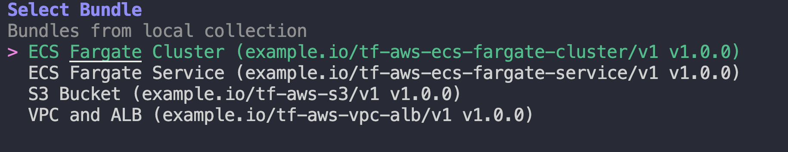
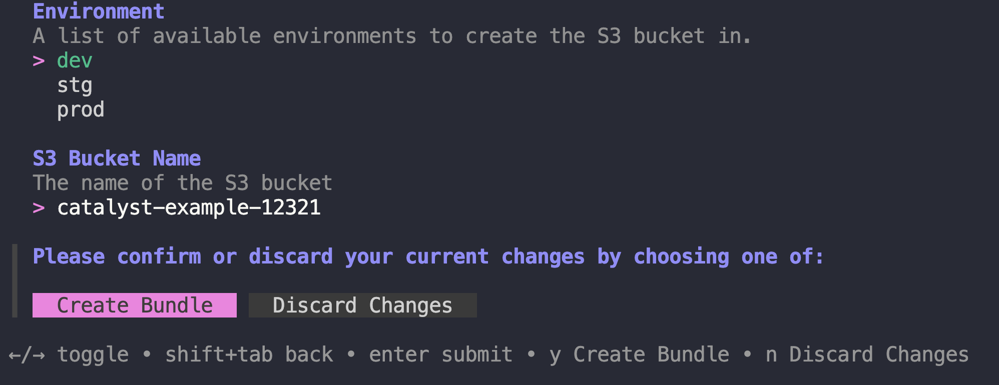

# terramate-catalyst-examples

This repository contains examples demonstrating how [Terramate Catalyst](https://github.com/terramate-io/terramate-catalyst) enables developers to self-service provision infrastructure on AWS with Terraform.

## About Terramate Catalyst

Terramate Catalyst enables developers and AI agents to provision infrastructure through self-service while platform teams retain full control by centrally defining how infrastructure is provisioned using Terraform or OpenTofu.

Catalyst doesn't replace Infrastructure as Code — it operationalizes it. You can reuse your entire IaC investment without modifying any existing configuration. At its core are components (reusable IaC units like Terraform modules) and bundles (which combine components and abstract away details like environment and state management).

Developers don't need to understand Terraform or cloud provider details to consume infrastructure safely. Platform teams don't need to reinvent their IaC stack to enable self-service.

## Installation

Start by installing Terramate Catalyst with [asdf](https://asdf-vm.com/) package manager:

```sh
asdf plugin add terramate-catalyst https://github.com/terramate-io/asdf-terramate-catalyst
asdf install
```

Alternatively download the binary from the [terramate-catalyst](https://github.com/terramate-io/terramate-catalyst/releases) repository.

> **Note:** If you are already using Terramate CLI, Terramate Catalyst acts as a drop-in replacement. It provides two binaries (`terramate` and `terramate-ls`) that replace your standard Terramate CLI installation.

After the installing Terramate Catalyst, run `terramate version` to see the version installed.

```sh
terramate version 
0.15.2-beta11
```

## Getting Started

To see what IaC bundles are available in this repository, run `terramate scaffold`.



Choose for example the S3 Bucket Bundle to start creating a private S3 bucket.



### Overview

#### Bundles

Bundles provide Infrastructure as Code blueprints that define what Terramate Stacks should be created and what Terramate Components should be instantiated within those stacks. They solve several technical problems:

- **Manual stack creation**: Automatically create and configure Terramate Stacks without manual setup
- **State management**: Abstract away state backend configuration and management complexity
- **Component orchestration**: Handle component relationships, dependencies, and instantiation automatically
- **Environment abstraction**: Simplify environment-specific configuration and state management
- **Consistency enforcement**: Ensure infrastructure follows platform team-defined patterns and standards
- **Developer experience**: Provide a guided, interactive experience that only prompts for essential inputs

##### VPC and ALB (`tf-aws-vpc-alb`)

Creates and manages a VPC with public and private subnets, NAT gateway, and an Application Load Balancer infrastructure. The ALB is configured with a basic HTTP listener, but target groups and routing rules should be added when deploying services.

- Creates a VPC with public and private subnets
- Sets up NAT Gateway and Internet Gateway
- Deploys an Application Load Balancer (ALB) in public subnets
- Provides foundational networking infrastructure

##### ECS Fargate Cluster (`tf-aws-ecs-fargate-cluster`)

Creates and manages an ECS Fargate cluster on AWS with a default capacity provider strategy that balances cost savings (Fargate Spot) with reliability (Fargate on-demand).

- Creates an ECS Fargate cluster
- Configures capacity provider strategy (Fargate Spot + on-demand)

##### ECS Fargate Service (`tf-aws-ecs-fargate-service`)

Creates and manages an ECS Fargate service that can be attached to existing ECS clusters, VPCs, and Application Load Balancers. It uses filter tags to discover and reference existing infrastructure resources via AWS data sources.

- Creates an ECS Fargate service attached to existing cluster, VPC, and ALB
- Uses AWS data sources to discover resources by tags
- Configures container definitions and load balancer integration

##### S3 Bucket (`tf-aws-s3`)

Creates and manages a private S3 bucket on AWS.

- Creates a private S3 bucket
- Enables versioning
- Configures basic bucket settings

#### Components

Components define what code should be generated given a set of Component Inputs combined with Terramate Code Generation. They solve several technical problems:

- **Code reuse**: Package reusable IaC patterns (like Terraform modules) into standardized components
- **Input abstraction**: Define clear input interfaces with validation, defaults, and descriptions
- **Code generation**: Use Terramate Code Generation to produce IaC files based on inputs
- **Consistency**: Ensure infrastructure follows the same patterns across different stacks and environments
- **Maintainability**: Centralize infrastructure logic so updates propagate to all instantiations
- **Separation of concerns**: Separate what infrastructure to create (components) from how it's orchestrated (bundles)

##### AWS VPC (`terramate-aws-vpc`)

Allows creating a VPC on AWS with public and private subnets, NAT gateway, and internet gateway.

- Creates VPC with public and private subnets
- Configures NAT Gateway and Internet Gateway
- Sets up route tables and security groups

##### AWS Application Load Balancer (`terramate-aws-alb`)

Allows creating an Application Load Balancer on AWS.

- Creates Application Load Balancer
- Configures listeners and target groups
- Sets up security groups for ALB

##### AWS ECS Cluster (`terramate-aws-ecs-cluster`)

Allows creating an ECS cluster on AWS with a default capacity provider strategy.

- Creates ECS cluster
- Configures capacity providers

##### AWS ECS Service (`terramate-aws-ecs-service`)

Allows creating an ECS Fargate service on AWS with container definitions, load balancer integration, and blue/green deployment support. Uses AWS data sources to reference existing clusters, VPCs, and ALBs.

- Creates ECS Fargate service
- Configures container definitions
- Sets up load balancer integration
- Uses AWS data sources to reference existing clusters, VPCs, and ALBs
- Uses private subnets with NAT Gateway for internet access
- Supports blue/green deployment configuration

##### AWS S3 Bucket (`terramate-aws-s3-bucket`)

Allows creating a private S3 bucket on AWS with versioning enabled.

- Creates private S3 bucket
- Enables versioning
