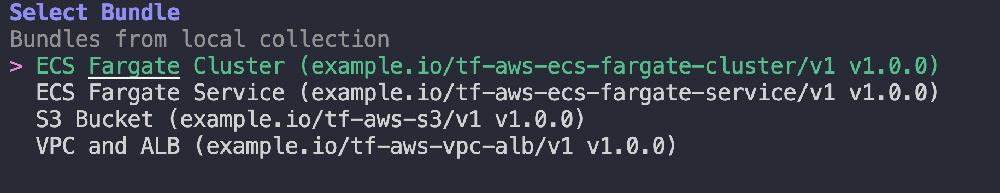
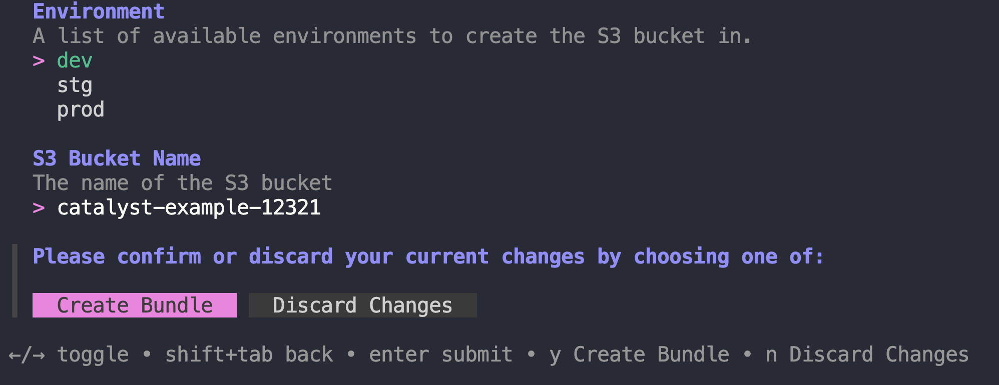

# Terramate Self-Service Examples

This repository contains practical examples demonstrating how [Terramate](https://github.com/terramate-io/terramate) enables developers to self-service provision infrastructure on AWS using Terraform without writing Terraform code themselves.

## About Terramate

[Terramate Catalyst](https://terramate.io/rethinking-iac/technical-introduction-to-terramate-catalyst/) transforms how infrastructure is delivered and consumed inside organizations by introducing two new primitives: **Bundles** and **Components**.

### Components

Components are reusable, opinionated infrastructure blueprints defined by platform engineers. They encode organizational standards, governance rules, naming conventions, security policies, cost controls, and more. In practice, a Component may represent a "database setup," "message queue," "VPC," "cache cluster," or any other infrastructure pattern.

Components can contain any arbitrary IaC—Terraform/OpenTofu resources, Terraform modules, Kubernetes manifests, or any other infrastructure-as-code. The idea is to provide infrastructure patterns that can be reused by platform engineers and sourced by one or multiple Bundles.

### Bundles

Bundles assemble one or more Components into ready-to-use, deployable units. These are what developers and AI agents consume when requesting infrastructure. Bundles abstract away all the complexity: no need to write Terraform, manage state, or deal with providers—you declare what you need (e.g., "a database for service X in environment Y"), and Terramate fills in the rest.

### Division of Responsibilities

This separation creates a **clear division of responsibility**:

- **Platform Engineers** design and maintain infrastructure logic, compliance, scalability, and IaC best practices.
- **Developers** (or AI agents) request infrastructure via simple, high-level abstractions—without needing to understand Terraform, module variables, or backend configuration.

In other words: Terramate doesn't replace IaC—it operationalize it and elegantly hides the complexity for non-expert infrastructure "consumers".

## Installation

### Install Terramate CLI

The easiest way to install Terramate is via the **asdf** package manager:

```sh
asdf plugin add terramate
asdf install # Run inside this repo
```

or by using Homebrew

```sh
brew install terramate
```

For other installation methods (Ubuntu/Debian, Fedora/CentOS, Windows, Docker, Go, etc.), see the [Terramate CLI installation documentation](https://terramate.io/docs/cli/installation).

### Verify Installation

After installing Terramate, verify the installation:

```sh
terramate version
# Should output: 0.17.1
```

## Getting Started

Clone this repository to explore the examples:

```sh
git clone git@github.com:terramate-io/terramate-catalyst-examples.git
cd terramate-catalyst-examples
```

### Explore Available Bundles

To see what infrastructure bundles are available in this repository, run:

```sh
terramate scaffold
```

This interactive command will show you all available bundles and guide you through creating infrastructure instances.



### Example: Create an S3 Bucket

Choose the **S3 Bucket Bundle** to create an S3 bucket with just a few prompts—no Terraform knowledge required:



The scaffold command will:
1. Prompt you for essential inputs (bucket name, visibility)
2. Create a bundle instance file (`.tm.yml`, or `.tm.hcl`)
3. Generate all necessary Terramate stacks and Terraform configuration

After scaffolding, generate the infrastructure code:

```sh
terramate generate
```

Then deploy with Terraform:

```sh
terramate run -- terraform init
terramate run -- terraform plan
terramate run -- terraform apply
```

### Managing Multiple Environments

A single bundle instance configuration can target multiple environments (e.g., dev, stg, prd) at once. Default inputs are defined in `spec.inputs` and apply to every environment. To customize specific inputs for an individual environment, add overrides under the `environments` block—only the inputs that differ need to be specified.

For example:

```yaml
apiVersion: terramate.io/cli/v1
kind: BundleInstance
metadata:
  name: terramate-example-bucket
spec:
  source: /bundles/example.com/tf-aws-s3/v1
  inputs:
    name: terramate-example-bucket
    visibility: private          # default for all environments
environments:
  dev: {}                        # uses all defaults (private)
  stg:
    visibility: public-read      # overrides visibility for staging
  prd:
    visibility: public-read-write # overrides visibility for production
```

Here, `dev` inherits the default `visibility: private`, while `stg` and `prd` each override only the `visibility` input. All other inputs (like `name`) remain the same across all three environments. After editing the file, run `terramate generate` to regenerate the Terraform code for the affected stacks.

## Examples in This Repository

This repository demonstrates several real-world scenarios:

### 1. Simple S3 Bucket Deployment

**Bundle:** `example.com/tf-aws-s3/v1`

Allows developers to deploy a simple S3 bucket by defining its name and ACL only—without ever touching Terraform.

**Component:** `example.com/tf-aws-s3/v1`

Creates an S3 bucket with:
- Configurable ACL (default: private)
- Versioning enabled
- Server-side encryption (AES256)

### 2. Complete ECS Fargate Cluster

**Bundle:** `example.com/tf-aws-complete-ecs-fargate-cluster/v1`

Deploys a complete, production-ready ECS Fargate cluster with VPC, ALB, and networking—all in minutes.

**Components:**
- `example.com/tf-aws-vpc/v1` - VPC with public/private subnets, NAT Gateway
- `example.com/terramate-aws-alb/v1` - Application Load Balancer
- `example.com/terramate-aws-ecs-cluster/v1` - ECS Fargate cluster

This bundle demonstrates how multiple components work together to create complex infrastructure.

### 3. ECS Fargate Service Deployment

**Bundle:** `example.com/tf-aws-ecs-fargate-service/v1`

Deploys containerized services on existing ECS clusters. The bundle automatically discovers available clusters and configures the ALB to route traffic to the new service.

**Component:** `example.com/aws-ecs-service/v1`

Creates an ECS Fargate service with:
- Container definitions
- Load balancer integration
- Automatic ALB listener rule creation
- Blue/green deployment support

This example showcases **Bundle-to-Bundle relationships**—how bundles can discover and integrate with infrastructure created by other bundles.

## Available Bundles

### Account (`example.com/account/v1`)

Organizational bundle that represents an account (e.g., AWS account, GCP project). This bundle does not create any Terraform stacks — it provides identity and hierarchy for infrastructure bundles.

**Inputs:**
- `account_alias` — A human-friendly alias for the account
- `account_id` — The account identifier (e.g., AWS account ID or GCP project ID)

### Region (`example.com/region/v1`)

Organizational bundle that represents a region within an account. This bundle does not create any Terraform stacks — it provides region and account identity for infrastructure bundles.

**Inputs:**
- `account` — Reference to an Account Bundle instance (typed as `bundle("example.com/account/v1")`)
- `region` — The region identifier (e.g., us-east-1, eu-west-1)

### AWS S3 Bucket (`example.com/tf-aws-s3/v1`)

Creates and manages an S3 bucket on AWS. The bucket can be configured as private or public, with private as the default.

**Features:**
- Configurable ACL/visibility (private/public)
- Versioning enabled
- Server-side encryption (AES256)
- Configurable tags

### Complete ECS Fargate Cluster (`example.com/tf-aws-complete-ecs-fargate-cluster/v1`)

Creates a complete, production-ready ECS Fargate cluster infrastructure on AWS.

**Features:**
- VPC with public and private subnets
- NAT Gateway and Internet Gateway
- Application Load Balancer (ALB) in public subnets
- ECS Fargate cluster with capacity provider strategy
- Automatic detection and integration of ECS services

### ECS Fargate Service (`example.com/tf-aws-ecs-fargate-service/v1`)

Creates and manages an ECS Fargate service that can be attached to existing ECS clusters, VPCs, and Application Load Balancers.

**Features:**
- References an existing ECS Cluster Bundle instance (typed as `bundle(...)`)
- Inherits account and region from the selected cluster — no separate region selection
- Uses AWS data sources to discover resources by tags
- Configures container definitions and load balancer integration
- Automatically updates ALB with listener rules and target groups
- Supports blue/green deployment configuration

## Available Components

### AWS VPC (`example.com/tf-aws-vpc/v1`)

Creates a VPC on AWS with public and private subnets, NAT gateway, and internet gateway.

**Features:**
- VPC with configurable CIDR block
- Public and private subnets across multiple availability zones
- NAT Gateway and Internet Gateway
- Route tables and security groups

### AWS Application Load Balancer (`example.com/terramate-aws-alb/v1`)

Creates an Application Load Balancer on AWS with automatic detection of ECS services.

**Features:**
- Application Load Balancer in public subnets
- Configurable listeners and target groups
- Automatic listener rule creation for ECS services
- Security groups for ALB

### AWS ECS Cluster (`example.com/terramate-aws-ecs-cluster/v1`)

Creates an ECS cluster on AWS with a default capacity provider strategy.

**Features:**
- ECS Fargate cluster
- Capacity provider strategy (Fargate Spot + on-demand)
- Configurable cluster settings

### AWS ECS Service (`example.com/aws-ecs-service/v1`)

Creates an ECS Fargate service on AWS with container definitions, load balancer integration, and blue/green deployment support.

**Features:**
- ECS Fargate service
- Container definitions with configurable images, ports, CPU, and memory
- Load balancer integration
- Uses AWS data sources to reference existing clusters, VPCs, and ALBs
- Uses private subnets with NAT Gateway for internet access
- Supports blue/green deployment configuration

### AWS S3 Bucket (`example.com/tf-aws-s3/v1`)

Creates an S3 bucket on AWS with configurable ACL, versioning, and encryption.

**Features:**
- Configurable ACL/visibility (private/public)
- Versioning enabled
- Server-side encryption (AES256)
- Configurable tags

## How It Works

### Scaffolding Complex IaC

Terramate enables self-service infrastructure provisioning by scaffolding the entire IaC stack, including state configuration and providers, without requiring developers to have knowledge of Terraform, OpenTofu, or HCL (HashiCorp Configuration Language).

Developers can use:
- The `terramate scaffold` command to choose from bundles available in the current repository, a remote repository, or the upcoming registry in Terramate Cloud
- The Terramate [Agent Skills](https://github.com/terramate-io/agent-skills) and [MCP Server](https://github.com/terramate-io/terramate-mcp-server) for AI agent integration
- Direct bundle instance file creation

### Bundle Relationships

Bundles can discover and integrate with infrastructure created by other bundles. The `bundle(...)` input type lets a Bundle reference an existing instance of another Bundle directly — Terramate populates the dropdown automatically and the referenced Bundle's inputs and exports become available via `bundle.input.<name>.value`.

For example, the ECS Fargate Service Bundle references an existing ECS Cluster:

```hcl
input "cluster" {
  type        = bundle("example.com/tf-aws-complete-ecs-fargate-cluster/v1")
  immutable   = true
  description = "The ECS cluster to attach this service to"

  prompt {
    text = "Elastic Container Service (ECS) Cluster"
  }
}
```

The Service can then read the Cluster's inputs and exports directly — for example, to derive its stack path from the Cluster's region:

```hcl
path = "/stacks/${bundle.environment.id}/${bundle.input.cluster.value.export.account_alias_slug.value}/${bundle.input.cluster.value.export.region_slug.value}/fargate-clusters/${bundle.input.cluster.value.alias}/workloads/${tm_slug(bundle.input.service_name.value)}"
```

When a new ECS service is deployed, the ALB bundle automatically detects it and updates the load balancer configuration to include the necessary listener rules and target groups.

### Versioning

Both Components and Bundles can be managed and versioned in Git repositories using semantic versioning. The upcoming Terramate Registry will provide a dashboard to track Bundle and Component usage, as well as versions across multiple repositories and teams.

## Project Structure

```bash
terramate-catalyst-examples/
│
├── .github/workflows/   # CI/CD workflows
│   ├── preview.yml      # PR preview (format, plan, sync)
│   ├── deploy.yml       # Deployment on merge to main
│   └── drift.yml        # Scheduled drift detection
│
├── terramate.tm.hcl     # Root Terramate config (environments, experiments, cloud org)
├── config.tm.hcl        # Project-level globals (AWS region, Terraform version)
├── .tool-versions       # asdf version pinning (Terraform, Terramate)
│
├── bundles/              # Bundle definitions
│   └── example.com/      # use your domain here for your own bundles
│       ├── account/                               # Account hierarchy bundle (organizational)
│       ├── region/                                # Region hierarchy bundle (organizational)
│       ├── tf-aws-complete-ecs-fargate-cluster/   # The Fargate Cluster  bundle
│       ├── tf-aws-ecs-fargate-service/            # The Fargate Workload bundle
│       └── tf-aws-s3/                             # The S3 bundle
│
├── components/          # Component definitions
│   └── example.com/     # use your domain here for your own components
│       ├── terramate-aws-vpc/v1/
│       ├── terramate-aws-alb/v1/
│       ├── terramate-aws-ecs-cluster/v1/
│       ├── terramate-aws-ecs-service/v1/
│       └── terramate-aws-s3-bucket/v1/
│
│ # Bundle instances (configured by scaffold and reconfigure commands or manually maintained)
│ #  - each instance contains configurations for all environments in a single file
│ #  - per-environment input overrides are supported (see "Managing Multiple Environments" above)
│
├── configs/accounts/{account}.tm.yml                                # Account bundle instances
├── configs/accounts/{account}/region_{region}.tm.yml                # Region bundle instances
├── configs/fargate-clusters/{slug}/cluster.tm.yml                   # Cluster bundle instances
├── configs/fargate-clusters/{slug}/service_{name}.tm.yml            # Workload bundle instances
├── configs/s3-buckets/s3_{name}.tm.hcl                              # S3 bundle instances
│
│ # Generated Terramate Stacks and Terraform Code for all configured environments
│ # Stacks are organized by environment, account, and region:
│
│   # stacks managed by fargate cluster bundles
├── stacks/{env}/{account}/{region}/fargate-clusters/{cluster}/vpc                  # a clusters VPC stack
├── stacks/{env}/{account}/{region}/fargate-clusters/{cluster}/alb                  # a clusters ALB stack
├── stacks/{env}/{account}/{region}/fargate-clusters/{cluster}/cluster              # the cluster itself stack
│
│   # stacks managed by fargate workload bundles
├── stacks/{env}/{account}/{region}/fargate-clusters/{cluster}/workloads/{service}  # workloads for the cluster
│
│   # stacks managed by S3 bundles
├── stacks/{env}/{account}/{region}/s3-buckets/{name}  # S3 buckets
│
└── imports/             # Shared configuration and mixins
```

## Learn More

- **[Technical Introduction to Terramate Catalyst](https://terramate.io/rethinking-iac/technical-introduction-to-terramate-catalyst/)** - Comprehensive guide with hands-on examples
- **[Terramate Catalyst GitHub Repository](https://github.com/terramate-io/terramate-catalyst)**
- **[Terramate Documentation](https://terramate.io/docs/)** - Terramate CLI documentation

## Contributing

Contributions are welcome! Please feel free to submit a Pull Request.
